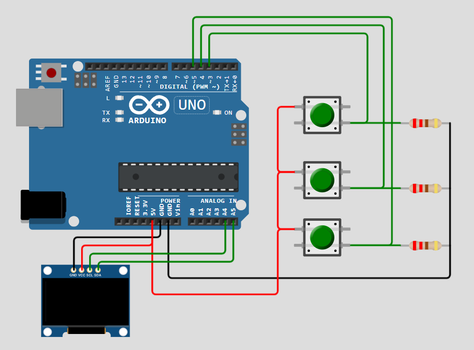

# ARD-003-Space-Shooter-Game🚀
Bring the classic arcade vibe to your desk with this Space Shooter Game built on Arduino UNO and an OLED display! Control your spaceship with push buttons, shoot enemies, and dodge obstacles — all displayed on a tiny OLED screen.

---

## 🛠 Components Required

1. [Arduino UNO](https://robocraze.com/products/uno-r3-board-compatible-with-arduino?_pos=3&_psq=ARDUINO&_ss=e&_v=1.0)
2. [1.3 inch OLED Display](https://robocraze.com/products/1-3in-oled-display?_pos=6&_psq=oled&_ss=e&_v=1.0)
3. [Push Button](https://robocraze.com/products/4-pins-dip-momentary-square-tactile-push-button-switch-10-pieces-6x6x5mm?_pos=1&_sid=7a5518733&_ss=r)
4. [220Ω Resistor](https://robocraze.com/products/220-ohm-resistor-pack-of-10?_pos=1&_psq=220&_ss=e&_v=1.0)
5. [Breadboard](https://robocraze.com/products/breadboard?_pos=3&_psq=BREADBOARD&_ss=e&_v=1.0)
6. [Jumper Wires](https://robocraze.com/products/f2m-jumper-wires-20cm-40pcs?_pos=1&_psq=JUMPER+WIRES&_ss=e&_v=1.0)

---

## 🎥 Project Demo

👉 [Watch on Instagram](https://www.instagram.com/reel/DNA8re6zUNQ/?igsh=MW9jOXhqcnhma3Q5aA==)

---
## Circuit Diagram

